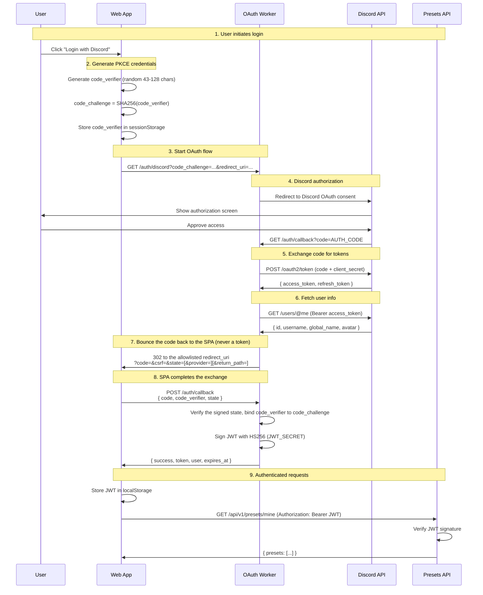
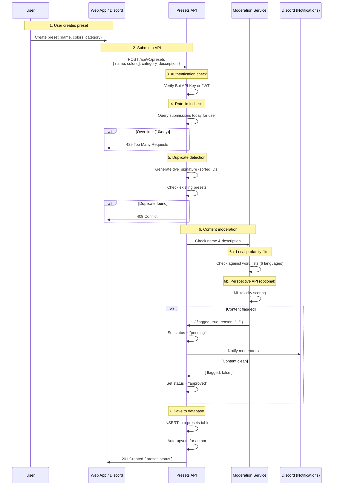
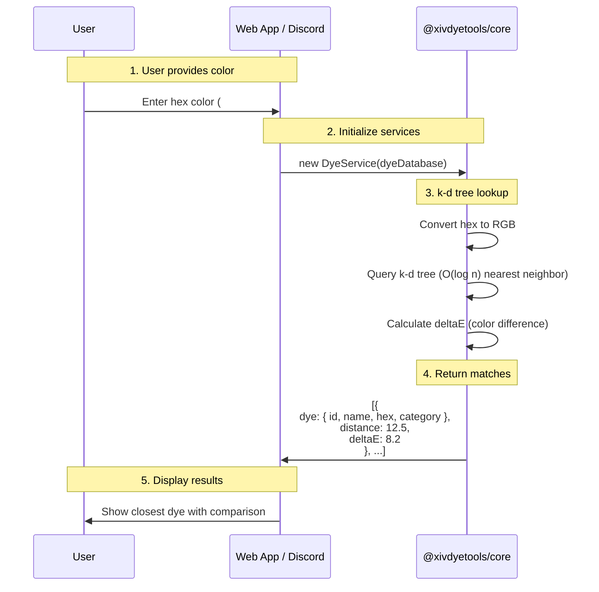
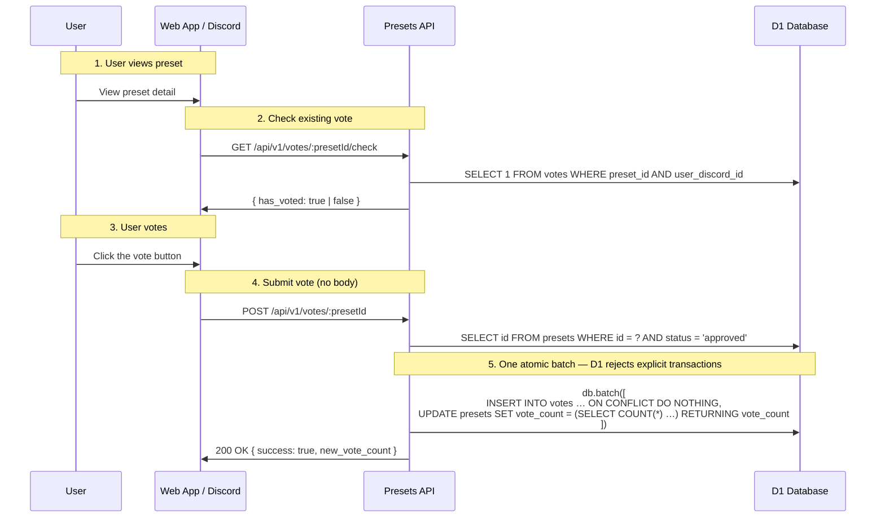
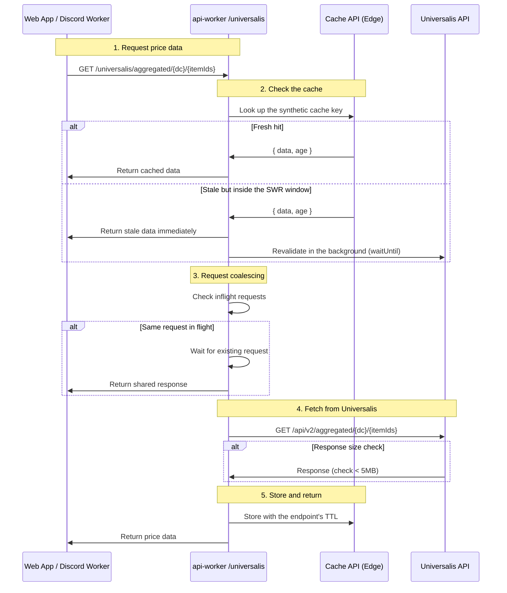
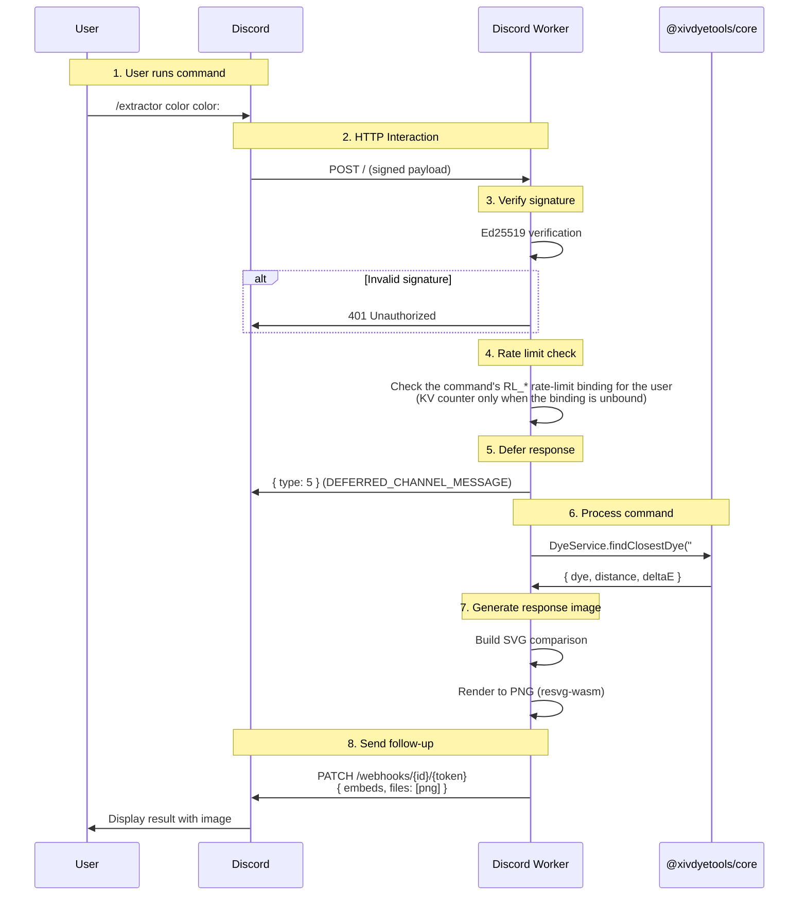

# Data Flow

**Sequence diagrams for key user journeys in the XIV Dye Tools ecosystem**

---

## Authentication Flow (PKCE OAuth)

The web app authenticates users via Discord OAuth with PKCE for security.



### JWT Payload Structure

```json
{
  "sub": "user-uuid",
  "iat": 1702684800,
  "exp": 1702688400,
  "iss": "https://auth.xivdyetools.app",
  "username": "User#1234",
  "global_name": "Display Name",
  "avatar": "avatar_hash",
  "auth_provider": "discord",
  "discord_id": "123456789012345678"
}
```

---

## Preset Submission Flow

Users submit community presets which go through moderation before publishing.



### Moderation Pipeline Detail

```
Input: { name: "My Preset", description: "A cool outfit" }
           │
           ▼
┌─────────────────────────┐
│  Local Profanity Filter │ ◄── Fast, runs first
│  (6 language word lists)│
└───────────┬─────────────┘
            │
            ▼ (if passed)
┌─────────────────────────┐
│   Perspective API       │ ◄── ML-based, optional
│   (toxicity scoring)    │
└───────────┬─────────────┘
            │
            ▼ (if flagged)
┌─────────────────────────┐
│   Manual Review Queue   │ ◄── Moderator decision
│   (approve/reject)      │
└─────────────────────────┘
```

---

## Color Matching Flow

Core functionality for finding the closest FFXIV dye to any color.



### k-d Tree Performance

| Operation | Time Complexity | Typical Time |
|-----------|-----------------|--------------|
| Build tree (startup) | O(n log n) | ~2ms for 125 dyes (Facewear colours are excluded — not tradeable) |
| Nearest neighbor query | O(log n) | <0.1ms |
| k-nearest neighbors | O(k log n) | <0.5ms for k=5 |

---

## Voting Flow

Users vote on community presets to curate the best content. There is **one kind of vote** — a
toggleable upvote. There is no downvote: the votes table holds at most one row per
`(preset_id, user_discord_id)` and `presets.vote_count` is recomputed from it.



`DELETE /api/v1/votes/:presetId` removes the vote through the mirror-image batch. A repeat
`POST` answers `409` with `{ success: true, already_voted: true, new_vote_count }`.

---

## Market Price Flow

Fetching real-time FFXIV market prices from Universalis via the caching proxy, which lives
inside `api-worker` under `/universalis` (and `/api/v2` for compatibility).



### Caching Strategy

There is **one** cache layer: the Cloudflare Cache API. The proxy used to write a second
copy to KV; that layer was removed to stay clear of the free-tier KV write limits, so KV in
`api-worker` now only backs rate limiting.

| Endpoint | TTL | Stale-while-revalidate |
|----------|-----|------------------------|
| `/aggregated/:dc/:itemIds` (prices) | 5 min | +2 min |
| `/data-centers` | 24 h | +6 h |
| `/worlds` | 24 h | +6 h |

### Request Coalescing

When multiple clients request the same data simultaneously:
```
Request 1 ──┐
Request 2 ──┼──► Single upstream request ──► Shared response
Request 3 ──┘
```
This prevents thundering herd on the Universalis API.

---

## Discord Interaction Flow

How Discord bot commands are processed.



---

## Related Documentation

- [Service Bindings](service-bindings.md) - Worker-to-worker communication details
- [API Contracts](api-contracts.md) - Request/response specifications
- [Overview](overview.md) - High-level architecture diagram
