# Dependency Graph

**Package dependencies and consumption relationships across the XIV Dye Tools ecosystem**

---

## npm Package Dependencies

```mermaid
graph TD
    subgraph "npm Registry — Shared Packages"
        TYPES["@xivdyetools/types<br/>v1.14.0"]
        CRYPTO["@xivdyetools/crypto<br/>v1.1.0"]
        LOGGER["@xivdyetools/logger<br/>v1.2.2"]
        AUTH["@xivdyetools/auth<br/>v1.1.2"]
        RATELIMIT["@xivdyetools/rate-limiter<br/>v1.4.4"]
        WMW["@xivdyetools/worker-middleware<br/>v1.1.2"]
        TEST["@xivdyetools/test-utils<br/>v1.1.7"]
        CORE["@xivdyetools/core<br/>v2.6.0"]
        SVG["@xivdyetools/svg<br/>v1.1.2"]
        BLEND["@xivdyetools/color-blending<br/>v1.0.1"]
        BOTLOGIC["@xivdyetools/bot-logic<br/>v1.2.0"]
        BOTI18N["@xivdyetools/bot-i18n<br/>v1.2.0"]
    end

    subgraph "Consumer Applications"
        WEB["xivdyetools-web-app"]
        DISCORD["xivdyetools-discord-worker"]
        MODBOT["xivdyetools-moderation-worker"]
        OAUTH["xivdyetools-oauth"]
        PRESETS["xivdyetools-presets-api"]
        PROXY["xivdyetools-universalis-proxy"]
        OG["xivdyetools-og-worker"]
        APIWORKER["xivdyetools-api-worker"]
        APIDOCS["xivdyetools-api-docs"]
        STOAT["xivdyetools-stoat-worker"]
        MAINT["xivdyetools-maintainer"]
    end

    %% Foundation dependencies
    TYPES --> CORE
    TYPES --> LOGGER
    TYPES --> AUTH
    TYPES --> TEST
    CRYPTO --> AUTH
    LOGGER --> CORE
    LOGGER --> WMW
    RATELIMIT --> WMW

    %% Feature package dependencies
    CORE --> SVG
    CORE --> BLEND
    CORE --> BOTLOGIC
    SVG --> BOTLOGIC
    BLEND --> BOTLOGIC
    BOTI18N --> BOTLOGIC
    TYPES --> SVG
    TYPES --> BOTLOGIC

    %% Consumer dependencies
    CORE --> WEB
    CORE --> DISCORD
    CORE --> OG
    CORE --> APIWORKER
    CORE --> MAINT
    BOTLOGIC --> DISCORD
    BOTLOGIC --> STOAT
    SVG --> DISCORD
    SVG --> OG
    BOTI18N --> DISCORD
    BOTI18N --> STOAT
    BLEND --> DISCORD
    BLEND --> STOAT
    AUTH --> DISCORD
    AUTH --> MODBOT
    AUTH --> PRESETS
    RATELIMIT --> DISCORD
    RATELIMIT --> MODBOT
    RATELIMIT --> OAUTH
    RATELIMIT --> PRESETS
    RATELIMIT --> PROXY
    RATELIMIT --> APIWORKER
    RATELIMIT --> STOAT
    WMW --> DISCORD
    WMW --> MODBOT
    WMW --> OAUTH
    WMW --> PRESETS
    WMW --> PROXY
    WMW --> OG
    WMW --> APIWORKER
    LOGGER --> WEB
    LOGGER --> DISCORD
    LOGGER --> MODBOT
    LOGGER --> OAUTH
    LOGGER --> PRESETS
    LOGGER --> PROXY
    LOGGER --> OG
    LOGGER --> APIWORKER
    LOGGER --> STOAT
    TYPES --> WEB
    TYPES --> DISCORD
    TYPES --> MODBOT
    TYPES --> OAUTH
    TYPES --> PRESETS
    TYPES --> OG
    TYPES --> APIWORKER
    TYPES --> STOAT

    %% Test utils (dev dependency)
    TEST -.-> CORE
    TEST -.-> WEB
    TEST -.-> DISCORD
    TEST -.-> OAUTH
    TEST -.-> PRESETS
    TEST -.-> APIWORKER

    %% API docs documents the API worker
    APIDOCS -.->|"documents"| APIWORKER

    classDef npm fill:#fff3e0,stroke:#e65100
    classDef consumer fill:#e8f5e9,stroke:#2e7d32

    class TYPES,CRYPTO,LOGGER,AUTH,RATELIMIT,WMW,TEST,CORE,SVG,BLEND,BOTLOGIC,BOTI18N npm
    class WEB,DISCORD,MODBOT,OAUTH,PRESETS,PROXY,OG,APIWORKER,APIDOCS,STOAT,MAINT consumer
```



---

## Dependency Matrix

### Shared Packages

| Package | Depends On | Used By |
|---------|------------|---------|
| **@xivdyetools/types** | — | All projects |
| **@xivdyetools/crypto** | — | @xivdyetools/auth |
| **@xivdyetools/logger** | — | All projects except crypto, maintainer |
| **@xivdyetools/auth** | crypto | discord-worker, moderation-worker, presets-api |
| **@xivdyetools/rate-limiter** | — | discord-worker, moderation-worker, oauth, presets-api, universalis-proxy, api-worker, stoat-worker, worker-middleware |
| **@xivdyetools/worker-middleware** | logger, rate-limiter | discord-worker, moderation-worker, oauth, presets-api, universalis-proxy, og-worker, api-worker |
| **@xivdyetools/test-utils** | types, crypto | All projects (devDependency) |
| **@xivdyetools/core** | types, logger | web-app, discord-worker, og-worker, api-worker, maintainer |
| **@xivdyetools/color-blending** | core | discord-worker, stoat-worker |
| **@xivdyetools/svg** | core, color-blending, types | discord-worker, og-worker |
| **@xivdyetools/bot-logic** | core, bot-i18n, color-blending, svg, types | discord-worker, stoat-worker |
| **@xivdyetools/bot-i18n** | — | discord-worker, stoat-worker |

### Consumer Applications

| Project | Runtime Dependencies | Test Dependencies |
|---------|----------------------|-------------------|
| **web-app** | core, types, logger, lit, vite | test-utils, vitest, playwright |
| **discord-worker** | core, types, logger, auth, rate-limiter, worker-middleware, svg, bot-logic, bot-i18n, color-blending, hono, @resvg/resvg-wasm, @cf-wasm/photon | test-utils, vitest |
| **moderation-worker** | types, logger, auth, rate-limiter, worker-middleware, hono | test-utils, vitest |
| **oauth** | types, logger, crypto, rate-limiter, worker-middleware, hono | test-utils, vitest |
| **presets-api** | types, logger, auth, crypto, rate-limiter, worker-middleware, hono | test-utils, vitest |
| **universalis-proxy** | logger, rate-limiter, worker-middleware, hono | vitest |
| **og-worker** | core, types, svg, logger, worker-middleware, hono, @resvg/resvg-wasm | vitest |
| **api-worker** | core, types, logger, rate-limiter, worker-middleware, hono | test-utils, vitest |
| **api-docs** | (none — VitePress static site documenting api-worker) | — |
| **stoat-worker** | core, types, logger, rate-limiter, bot-logic, bot-i18n, color-blending, svg, revolt.js | vitest |
| **maintainer** | core, vue, express, zod | vitest |

---

## Core Library Internal Structure

```
@xivdyetools/core (v2.6.0)
├── services/
│   ├── ColorService.ts      ← ColorConverter, ColorAccessibility, ColorManipulator
│   ├── DyeService.ts        ← DyeDatabase (k-d tree), DyeSearch, HarmonyGenerator
│   ├── APIService.ts        ← Universalis API wrapper with LRU cache + metrics
│   ├── PaletteService.ts    ← K-means++ clustering algorithm
│   ├── PresetService.ts     ← Curated preset palettes, ResolvedPreset
│   └── LocalizationService.ts
├── config/
│   └── consolidated-ids.ts  ← Patch 7.5 dye consolidation (Type-A=52254, B=52255, C=52256)
├── data/
│   └── colors_xiv.json      ← 136 entries: 125 standard FFXIV dyes + 11 Facewear color entries
│                              (Facewear entries get synthetic negative IDs at runtime)
└── locales/
    └── {en,ja,de,fr,ko,zh}.json

Notes:
- As of v2.0.0, type re-exports are removed. Import Dye, RGB, HexColor, etc. from
  @xivdyetools/types directly. 28 internal symbols are marked @internal and excluded
  from the barrel export.
- As of v2.6.0, ALLIED_SOCIETY_ACQUISITIONS is removed. Patch 7.5 collapsed those
  vendor categories out of colors_xiv.json.
```

---

## Third-Party Dependencies by Project

### xivdyetools-web-app

| Package | Version | Purpose |
|---------|---------|---------|
| `lit` | ^3.1 | Web components framework |
| `vite` | ^6.x | Build tool and dev server |
| `tailwindcss` | ^4.2 | Utility-first CSS |

### xivdyetools-discord-worker

| Package | Version | Purpose |
|---------|---------|---------|
| `hono` | ^4.12 | HTTP framework for Workers |
| `discord-interactions` | ^4.4 | Ed25519 signature verification |
| `@resvg/resvg-wasm` | ^2.6 | SVG to PNG rendering |
| `@cf-wasm/photon` | ^0.3 | Image processing (dominant color) |

### xivdyetools-oauth / presets-api / moderation-worker / universalis-proxy

| Package | Version | Purpose |
|---------|---------|---------|
| `hono` | ^4.12 | HTTP framework for Workers |

### xivdyetools-stoat-worker

| Package | Version | Purpose |
|---------|---------|---------|
| `revolt.js` | ^7.1 | Revolt API client |

### xivdyetools-maintainer

| Package | Version | Purpose |
|---------|---------|---------|
| `vue` | ^3.5 | Frontend framework |
| `express` | ^5.2 | Backend HTTP server |
| `zod` | ^4.3 | Schema validation |

---

## Version Synchronization

Internal dependencies use the `workspace:*` protocol and resolve automatically within the pnpm monorepo.

When updating a **shared package** (e.g., `@xivdyetools/core`):

1. Make changes in `packages/core/`
2. Build and test:
   ```bash
   pnpm turbo run build test --filter=@xivdyetools/core
   ```
3. Bump version in `packages/core/package.json`
4. Publish:
   ```bash
   pnpm --filter @xivdyetools/core publish --provenance --access public --no-git-checks
   ```
5. Consumer apps automatically use the latest workspace version in development. For production deploys, rebuild and redeploy affected consumers.

### Breaking Change Protocol

If a core library change is breaking:

1. Increment major version (e.g., 1.17.2 → 2.0.0)
2. Update all consumers to handle breaking changes
3. Update minimum version in compatibility matrix ([versions.md](../versions.md))

---

## Related Documentation

- [Service Bindings](service-bindings.md) - Worker-to-worker communication
- [API Contracts](api-contracts.md) - Inter-service API specifications
- [Versions](../versions.md) - Current version matrix
