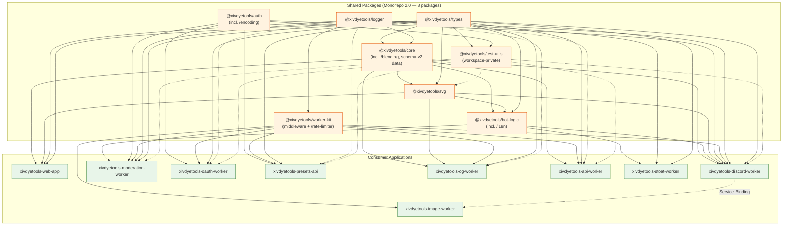

# Dependency Graph

**Package dependencies and consumption relationships across the XIV Dye Tools ecosystem**

Current versions: see [versions.md](../versions.md) — this document tracks the *shape* of the
graph, not the numbers.

---

## npm Package Dependencies


```mermaid
graph TD
    subgraph "Shared Packages (Monorepo 2.0 — 8 packages)"
        TYPES["@xivdyetools/types"]
        LOGGER["@xivdyetools/logger"]
        AUTH["@xivdyetools/auth<br/>(incl. /encoding)"]
        WKIT["@xivdyetools/worker-kit<br/>(middleware + /rate-limiter)"]
        TEST["@xivdyetools/test-utils<br/>(workspace-private)"]
        CORE["@xivdyetools/core<br/>(incl. /blending, schema-v2 data)"]
        SVG["@xivdyetools/svg"]
        BOTLOGIC["@xivdyetools/bot-logic<br/>(incl. /i18n)"]
    end

    subgraph "Consumer Applications"
        WEB["xivdyetools-web-app"]
        DISCORD["xivdyetools-discord-worker"]
        MODBOT["xivdyetools-moderation-worker"]
        OAUTH["xivdyetools-oauth-worker"]
        PRESETS["xivdyetools-presets-api"]
        OG["xivdyetools-og-worker"]
        APIWORKER["xivdyetools-api-worker"]
        STOAT["xivdyetools-stoat-worker"]
        IMGWORKER["xivdyetools-image-worker"]
    end

    %% Foundation dependencies
    TYPES --> CORE
    TYPES --> TEST
    AUTH --> TEST
    LOGGER --> CORE
    LOGGER --> WKIT

    %% Feature package dependencies
    CORE --> SVG
    CORE --> BOTLOGIC
    SVG --> BOTLOGIC
    TYPES --> SVG
    TYPES --> BOTLOGIC

    %% Consumer dependencies (declared, direct)
    CORE --> WEB
    CORE --> DISCORD
    CORE --> OG
    CORE --> APIWORKER
    BOTLOGIC --> DISCORD
    BOTLOGIC --> MODBOT
    BOTLOGIC --> STOAT
    SVG --> WEB
    SVG --> DISCORD
    SVG --> OG
    AUTH --> DISCORD
    AUTH --> MODBOT
    AUTH --> OAUTH
    AUTH --> PRESETS
    WKIT --> DISCORD
    WKIT --> MODBOT
    WKIT --> OAUTH
    WKIT --> PRESETS
    WKIT --> OG
    WKIT --> APIWORKER
    WKIT --> IMGWORKER
    LOGGER --> WEB
    LOGGER --> DISCORD
    LOGGER --> MODBOT
    LOGGER --> STOAT
    TYPES --> WEB
    TYPES --> DISCORD
    TYPES --> MODBOT
    TYPES --> OAUTH
    TYPES --> PRESETS
    TYPES --> OG
    TYPES --> APIWORKER
    TYPES --> STOAT
    DISCORD -. Service Binding .-> IMGWORKER

    %% Transitive only — reached through worker-kit / core / bot-logic,
    %% never declared in these apps' package.json
    LOGGER -.-> OAUTH
    LOGGER -.-> PRESETS
    LOGGER -.-> OG
    LOGGER -.-> APIWORKER

    %% Test utils (devDependency)
    TEST -.-> SVG
    TEST -.-> DISCORD
    TEST -.-> MODBOT
    TEST -.-> OAUTH
    TEST -.-> PRESETS
    TEST -.-> APIWORKER

    classDef npm fill:#fff3e0,stroke:#e65100
    classDef consumer fill:#e8f5e9,stroke:#2e7d32

    class TYPES,LOGGER,AUTH,WKIT,TEST,CORE,SVG,BOTLOGIC npm
    class WEB,DISCORD,MODBOT,OAUTH,PRESETS,OG,APIWORKER,STOAT,IMGWORKER consumer
```

---

## Dependency Matrix

### Shared Packages

"Used By" lists **declared** dependents only — an app that reaches a package transitively
(through `worker-kit`, `core` or `bot-logic`) is not listed.

| Package | Depends On | Used By (declared) |
|---------|------------|--------------------|
| **@xivdyetools/types** | — | core, svg, bot-logic, test-utils, web-app, discord-worker, moderation-worker, oauth, presets-api, og-worker, api-worker, stoat-worker |
| **@xivdyetools/logger** | — | core, worker-kit, web-app, discord-worker, moderation-worker, stoat-worker |
| **@xivdyetools/auth** (incl. `/encoding`) | discord-interactions | oauth, discord-worker, moderation-worker, presets-api, test-utils |
| **@xivdyetools/worker-kit** (middleware + `/rate-limiter`) | logger, @upstash/redis | discord-worker, moderation-worker, oauth, presets-api, og-worker, api-worker, image-worker |
| **@xivdyetools/test-utils** (workspace-private) | auth, types | svg, discord-worker, moderation-worker, oauth, presets-api, api-worker (devDependency) |
| **@xivdyetools/core** (incl. `/blending`) | types, logger, spectral.js | svg, bot-logic, web-app, discord-worker, og-worker, api-worker |
| **@xivdyetools/svg** | core, types | bot-logic, web-app, discord-worker, og-worker, api-worker (devDependency, docs build) |
| **@xivdyetools/bot-logic** (incl. `/i18n`) | core, svg, types | discord-worker, moderation-worker, stoat-worker |

### Consumer Applications

| Project | Runtime Dependencies | Test Dependencies |
|---------|----------------------|-------------------|
| **web-app** | core, types, logger, svg, lit | vitest, playwright, jsdom, msw, vite, tailwindcss |
| **discord-worker** | core, types, logger, auth, worker-kit, svg, bot-logic, hono, @resvg/resvg-wasm | test-utils, vitest |
| **moderation-worker** | types, logger, auth, worker-kit, bot-logic, hono | test-utils, vitest |
| **oauth** | types, auth, worker-kit, hono | test-utils, vitest |
| **presets-api** | types, auth, worker-kit, hono | test-utils, vitest |
| **og-worker** | core, types, svg, worker-kit, hono, @resvg/resvg-wasm | vitest |
| **api-worker** | core, types, worker-kit, hono | test-utils, svg, vitest, vitepress, vue |
| **stoat-worker** | types, logger, bot-logic, revolt.js | vitest |
| **image-worker** | worker-kit, hono, @cf-wasm/photon | vitest |

---

## Core Library Internal Structure

```
@xivdyetools/core
├── blending/                ← self-contained blending algorithms (subpath @xivdyetools/core/blending)
├── services/
│   ├── ColorService.ts      ← ColorConverter, ColorAccessibility, ColorManipulator
│   ├── DyeService.ts        ← DyeDatabase (k-d tree), DyeSearch, HarmonyGenerator
│   ├── APIService.ts        ← Universalis API wrapper with LRU cache + metrics
│   ├── PaletteService.ts    ← K-means++ clustering algorithm
│   ├── PresetService.ts     ← Curated preset palettes, ResolvedPreset
│   └── LocalizationService.ts
├── config/
│   ├── consolidated-ids.ts  ← Patch 7.5 dye consolidation (Type-A=52254, B=52255, C=52256)
│   └── dye-vocabulary.ts    ← Closed vocabularies + acquisition → (price, currency) coupling
└── data/
    ├── dyes.json            ← 125 standard dyes (schema v2: 7 fields, stainID-keyed; rgb/hsv/cost/flags derived at initialize())
    ├── facewear_colors.json ← 11 Facewear colors (NOT dyes — facewearColors export)
    ├── munsell-*.json / oklch-hue-table.json ← colour-wheel anchor tables
    ├── presets.json         ← curated preset palettes
    ├── character_colors/    ← character-creation colour sheets
    └── locales/{en,ja,de,fr,ko,zh}.json

Notes:
- As of v2.0.0, type re-exports are removed. Import Dye, RGB, HexColor, etc. from
  @xivdyetools/types directly. 28 internal symbols are marked @internal and excluded
  from the barrel export.
- As of v2.6.0, ALLIED_SOCIETY_ACQUISITIONS is removed. Patch 7.5 collapsed those
  vendor categories out of the dye database.
- As of v3.0.0 (schema v2), the data file is dyes.json (125 entries, stainID-keyed).
  The 11 Facewear colours moved to facewear_colors.json / the facewearColors export.
```

---

## Third-Party Dependencies by Project

### xivdyetools-web-app

| Package | Version | Purpose |
|---------|---------|---------|
| `lit` | ^3.3.3 | Web components framework |
| `vite` | ^8.2.2 | Build tool and dev server (devDependency) |
| `tailwindcss` | ^4.3.3 | Utility-first CSS (devDependency) |

### xivdyetools-discord-worker

| Package | Version | Purpose |
|---------|---------|---------|
| `hono` | ^4.13.5 | HTTP framework for Workers (floor set by FINDING-001: CORS ReDoS) |
| `@resvg/resvg-wasm` | ^2.6.2 | SVG to PNG rendering |

Ed25519 interaction-signature verification comes from `@xivdyetools/auth`, which is the
package that declares `discord-interactions` (`^4.4.0`) — the bot never depends on it directly.

`@cf-wasm/photon` moved to `xivdyetools-image-worker` (see below) — see
`docs/operations/IMAGE_WORKER_SPLIT.md` for why.

### xivdyetools-image-worker

| Package | Version | Purpose |
|---------|---------|---------|
| `hono` | ^4.13.5 | HTTP framework for Workers |
| `@cf-wasm/photon` | ^0.4.0 | Image decode/resize/pixel-extraction (WASM) — the sole reason this Worker exists |

### xivdyetools-oauth / presets-api / moderation-worker / og-worker / api-worker

| Package | Version | Purpose |
|---------|---------|---------|
| `hono` | ^4.13.5 | HTTP framework for Workers (floor set by FINDING-001: CORS ReDoS) |

### xivdyetools-stoat-worker

| Package | Version | Purpose |
|---------|---------|---------|
| `revolt.js` | ^7.1.1 | Revolt API client |

---

## Version Synchronization

Internal dependencies use the `workspace:*` protocol and resolve automatically within the pnpm monorepo.

When updating a **shared package** (e.g., `@xivdyetools/core`):

1. Make changes in `packages/core/`
2. Build and test:
   ```bash
   pnpm turbo run build test --filter=@xivdyetools/core
   ```
3. Bump version in `packages/core/package.json` and merge to `main`
4. Publish via the **Publish Packages to npm** workflow (Actions → run with
   package `@xivdyetools/core`). It authenticates using trusted publishing
   (OIDC); there is no npm token. See the root `CLAUDE.md` for the full flow.
5. Consumer apps automatically use the latest workspace version in development. For production deploys, rebuild and redeploy affected consumers.

### Breaking Change Protocol

If a core library change is breaking:

1. Increment major version (e.g., 1.17.2 → 2.0.0)
2. Update all consumers to handle breaking changes
3. Update minimum version in compatibility matrix ([versions.md](../versions.md))

---

## Related Documentation

- [Service Bindings](service-bindings.md) - Worker-to-worker communication
- [API Contracts](api-contracts.md) - Inter-service API specifications
- [Versions](../versions.md) - Current version matrix
