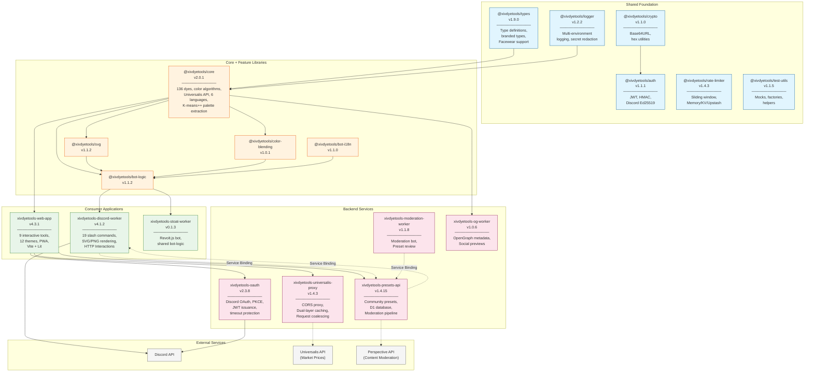

# Architecture Overview

**How the XIV Dye Tools ecosystem interconnects**

This document provides a high-level view of how all projects in the XIV Dye Tools ecosystem work together to deliver dye color tools across web and Discord platforms.

---

## Ecosystem Diagram



---

## Project Relationships

### Dependency Layers

```
Layer 4: External Services
├── Discord API (authentication, interactions)
├── Universalis API (FFXIV market prices)
└── Perspective API (ML content moderation)

Layer 4: External Services
├── Discord API (authentication, interactions)
├── Universalis API (FFXIV market prices)
└── Perspective API (ML content moderation)

Layer 3: Backend Services (Cloudflare Workers)
├── xivdyetools-oauth → JWT issuance
├── xivdyetools-presets-api → Community presets
├── xivdyetools-universalis-proxy → Market data caching
├── xivdyetools-moderation-worker → Preset moderation bot
└── xivdyetools-og-worker → Social media previews

Layer 2: Consumer Applications
├── xivdyetools-web-app → Browser-based tools (9 tools)
├── xivdyetools-discord-worker → Discord bot (19 commands)
└── xivdyetools-stoat-worker → Revolt bot (shared bot-logic)

Layer 1: Core + Feature Libraries
├── @xivdyetools/core → Color algorithms, dye database
├── @xivdyetools/svg → SVG card generation
├── @xivdyetools/color-blending → Color blending algorithms
├── @xivdyetools/bot-logic → Platform-agnostic bot commands
└── @xivdyetools/bot-i18n → Bot-specific localization

Layer 0: Shared Foundation
├── @xivdyetools/types → Type definitions, Facewear support
├── @xivdyetools/crypto → Base64URL, hex utilities
├── @xivdyetools/logger → Logging, secret redaction
├── @xivdyetools/auth → JWT, HMAC, Discord Ed25519
├── @xivdyetools/rate-limiter → Sliding window rate limiting
└── @xivdyetools/test-utils → Testing utilities
```

### Data Flow Summary

| Flow | Path | Purpose |
|------|------|---------|
| **Color Matching** | User → Web/Discord → Core → Response | Find closest dye to input color |
| **Market Prices** | Client → Universalis Proxy → Universalis API → Client | Real-time price data with caching |
| **Authentication** | User → OAuth → Discord API → JWT → Consumer | User identity |
| **Preset Submission** | User → Client → Presets API → Moderation → Storage | Community content |
| **Preset Voting** | User → Client → Presets API → Database | Community curation |
| **User Banning** | Moderator → Discord Bot → Presets API → Database | Content moderation |

---

## Project Summaries

### @xivdyetools/core (v2.0.1)

**Purpose**: Core TypeScript library providing color algorithms and the 136-dye database.

**Key Capabilities**:
- Color conversion (RGB, HSV, HSL, LAB, OKLAB)
- Nearest-neighbor dye matching via k-d tree
- Color harmony generation (complementary, triadic, analogous, etc.)
- Colorblindness simulation (Brettel algorithm)
- K-means++ palette extraction from images
- Universalis API integration with LRU cache and metrics
- 6-language localization (en, ja, de, fr, ko, zh)
- Facewear dye support (synthetic IDs ≤ -1000)
- Pre-computed lowercase names for fast search
- LRU cache for `rgbToOklab()` conversions

**v2.0.0 Breaking Change**: All type re-exports removed. Import `Dye`, `RGB`, `HexColor`, etc. from `@xivdyetools/types` directly. 28 symbols marked `@internal`.

**Consumed By**: Web app, Discord worker, OG worker, Maintainer

---

### xivdyetools-web-app (v4.3.1)

**Purpose**: Browser-based interactive toolkit for exploring FFXIV dye colors.

**9 Tools**:
1. **Palette Extractor** - Extract colors from images and find matching dyes
2. **Gradient Builder** - Create color gradients between dyes
3. **Color Harmony Explorer** - Discover harmonious dye combinations
4. **Dye Mixer** - RGB color blending between dyes
5. **Swatch Matcher** - Match character colors to dyes
6. **Dye Comparison** - Side-by-side dye analysis
7. **Accessibility Checker** - Colorblindness simulation
8. **Community Presets** - Browse and share dye presets
9. **Budget Suggestions** - Find affordable dye alternatives

**Recent Highlights**:
- **v4.3.0**: Pixel sampling (Shift+Click), canvas panning (Ctrl/Cmd+Drag), configurable sample area (1×1 to 16×16)
- **v4.2.0**: Prevent Duplicate Results toggle, Paste from Clipboard in Extractor
- **v4.0.0**: Glassmorphism UI, tool renaming, Lit.js web components, 12 themes

**Technology**: Vite 6, Lit web components, Tailwind CSS 4, 12 themes

---

### xivdyetools-discord-worker (v4.1.2)

**Purpose**: Discord bot bringing dye tools to servers via slash commands.

**19 Commands** organized into categories:
- **Color Tools**: `/harmony`, `/extractor`, `/gradient`, `/mixer`, `/swatch`, `/budget`
- **Dye Database**: `/dye search`, `/dye info`, `/dye list`, `/dye random`
- **Analysis**: `/comparison`, `/accessibility`
- **User Data**: `/favorites`, `/collection`
- **Community**: `/preset list`, `/preset show`, `/preset random`, `/preset submit`, `/preset vote`
- **Utility**: `/language`, `/preferences`, `/manual`, `/about`, `/stats`

**v4.x Highlights**:
- Command renaming (`/match`→`/extractor`, `/mixer`→`/gradient`)
- New commands: `/mixer` (RGB blending), `/swatch`, `/budget`, `/preferences`
- Prevent Duplicate Results for extractor
- Budget quick picks with 20 Cosmic dyes
- Uses shared packages: @xivdyetools/bot-logic, bot-i18n, svg, color-blending

**Technology**: Cloudflare Workers, HTTP Interactions, Hono, resvg-wasm, Photon WASM

---

### xivdyetools-oauth (v2.3.8)

**Purpose**: OAuth2 authentication provider for the ecosystem.

**Features**:
- Discord OAuth2 with PKCE flow
- JWT issuance with HS256 signing
- 24-hour refresh token grace period
- Account merging support
- Timeout protection (10s token exchange, 5s user info fetch)
- XIVAuth integration

**Technology**: Cloudflare Workers, Hono, D1 database

---

### xivdyetools-presets-api (v1.4.15)

**Purpose**: REST API for community dye preset management.

**Features**:
- CRUD operations for presets
- Voting system with per-user tracking
- Multi-layer moderation pipeline:
  - Local profanity filtering (6 languages)
  - Perspective API ML moderation (5s timeout protection)
  - Manual moderator review queue
- Rate limiting (10 submissions/user/day)
- Dual authentication (bot API key + JWT)
- Standardized API responses
- UTF-8 safe truncation for Discord embeds
- Race condition handling for duplicate detection
- Dynamic category validation (1-min cache)
- Discord notification retries with exponential backoff

**Technology**: Cloudflare Workers, Hono, D1 SQLite database

---

### xivdyetools-universalis-proxy (v1.4.3)

**Purpose**: CORS proxy for Universalis API with intelligent caching.

**Features**:
- **Dual-layer caching**:
  - Cloudflare Cache API (edge-level)
  - KV storage (global persistence)
- **Request coalescing** to prevent duplicate upstream requests
- **Stale-while-revalidate** pattern for optimal freshness
- Input validation (100 items max, ID range 1-1,000,000)
- Response size limit (5MB)
- Memory leak protection with 60s entry cleanup
- Cache TTLs: 5 min for prices, 24h for static data

**Technology**: Cloudflare Workers, Hono, KV storage

---

### xivdyetools-moderation-worker (v1.1.8)

**Purpose**: Separate Discord bot for community preset moderation.

**Commands**:
- `/preset moderate [preset_id]` - Review pending presets
- `/preset ban_user <user>` - Ban user from preset system
- `/preset unban_user <user>` - Unban user

**Features**:
- Approve/reject presets with reasons (notifies author)
- Revert flagged edits to previous versions
- Multi-language support (6 languages)
- Full audit logging of moderation actions
- Startup environment validation (v1.1.5)

**Technology**: Cloudflare Workers, Hono

---

### xivdyetools-og-worker (v1.0.6)

**Purpose**: Dynamic OpenGraph metadata for social media previews.

**Features**:
- Crawler detection (Discord, Twitter/X, Facebook, LinkedIn, Slack, Telegram, iMessage)
- Dynamic OG image generation for tools (Harmony, Gradient, Mixer, Swatch, Comparison, Accessibility)
- SVG→PNG rendering via resvg-wasm
- Embedded fonts for text rendering
- NaN validation for dyeId parameters (v1.0.4)
- escapeHtml for themeColor meta tag (v1.0.4)

**Routes**: `/og/harmony/*`, `/og/gradient/*`, `/og/mixer/*`, `/og/swatch/*`, `/og/comparison/*`, `/og/accessibility/*`

**Technology**: Cloudflare Workers, Hono, resvg-wasm

---

### xivdyetools-stoat-worker (v0.1.3)

**Purpose**: Revolt.js bot bringing dye tools to the Revolt platform.

**Features**:
- Shared command logic via @xivdyetools/bot-logic
- Shared i18n via @xivdyetools/bot-i18n
- Prefix-based commands (`!xivdye` / `!xd`)
- 4 commands: ping, help, about, info

**Technology**: Node.js 22+, revolt.js

---

### Shared Packages

| Package | Version | Purpose |
|---------|---------|---------|
| **@xivdyetools/types** | v1.9.0 | Branded types (HexColor, DyeId), Facewear ID support |
| **@xivdyetools/crypto** | v1.1.0 | Base64URL encoding, hex utilities |
| **@xivdyetools/logger** | v1.2.2 | Unified logging, secret redaction patterns |
| **@xivdyetools/auth** | v1.1.1 | JWT verification, HMAC signing, Discord Ed25519 |
| **@xivdyetools/rate-limiter** | v1.4.3 | Sliding window rate limiting (Memory, KV, Upstash) |
| **@xivdyetools/svg** | v1.1.2 | Platform-agnostic SVG card generators |
| **@xivdyetools/bot-logic** | v1.1.2 | Platform-agnostic bot command logic (193 tests) |
| **@xivdyetools/bot-i18n** | v1.1.0 | Bot-specific internationalization |
| **@xivdyetools/color-blending** | v1.0.1 | Color blending modes (RGB, LAB, OKLAB, Spectral) |
| **@xivdyetools/test-utils** | v1.1.5 | Cloudflare bindings mocks, domain factories, test helpers |

---

## Communication Patterns

### Service Bindings (Worker-to-Worker)

Cloudflare Service Bindings enable zero-latency communication between workers:

```typescript
// Discord Worker calling Presets API
if (env.PRESETS_API) {
  // Service Binding (no HTTP overhead)
  return env.PRESETS_API.fetch(request);
}
// Fallback to HTTP
return fetch(`${env.PRESETS_API_URL}/presets`, options);
```

**Binding Map**:
```
xivdyetools-discord-worker
├── PRESETS_API → xivdyetools-presets-api (Service Binding)
└── KV_STORAGE → Rate limits, user preferences (KV Binding)

xivdyetools-presets-api
├── DB → D1 Database (presets, votes, moderation)
└── KV_CACHE → Response caching (KV Binding)

xivdyetools-universalis-proxy
├── PRICE_CACHE → Price data with 5-min TTL (KV Binding)
└── STATIC_CACHE → Item data with 24h TTL (KV Binding)
```

### REST API Communication

| Caller | Target | Authentication |
|--------|--------|----------------|
| Web App | OAuth Worker | N/A (initiates OAuth flow) |
| Web App | Presets API | JWT Bearer token |
| Discord Worker | Presets API | `BOT_API_SECRET` + user headers |
| Presets API | OAuth Worker | JWT verification (shared secret) |

---

## Deployment Architecture

```
                        ┌─────────────────────────────────────┐
                        │          Cloudflare Edge            │
                        │         (Global Distribution)       │
                        └─────────────────┬───────────────────┘
                                          │
        ┌─────────────────────────────────┼─────────────────────────────────┐
        │                                 │                                 │
        ▼                                 ▼                                 ▼
┌───────────────────┐         ┌───────────────────┐         ┌───────────────────┐
│  Cloudflare Pages │         │  Cloudflare       │         │  Cloudflare       │
│                   │         │  Workers          │         │  D1 Database      │
│  xivdyetools      │         │                   │         │                   │
│  web-app          │         │  • discord-worker │         │  • presets        │
│  (Static assets)  │         │  • oauth          │         │  • votes          │
│                   │         │  • presets-api    │         │  • users          │
│                   │         │  • universalis-   │         │  • moderation     │
│                   │         │    proxy          │         │                   │
└───────────────────┘         └───────────────────┘         └───────────────────┘
                                          │
                                          │ KV Storage
                                          ▼
                              ┌───────────────────┐
                              │  Cloudflare KV    │
                              │                   │
                              │  • Rate limits    │
                              │  • User prefs     │
                              │  • Response cache │
                              │  • Price cache    │
                              │  • Static cache   │
                              └───────────────────┘
```

---

## Related Documentation

- [Dependency Graph](dependency-graph.md) - Detailed npm and service dependencies
- [Service Bindings](service-bindings.md) - Worker-to-worker communication
- [Data Flow](data-flow.md) - Sequence diagrams for key flows
- [API Contracts](api-contracts.md) - Inter-service API specifications
