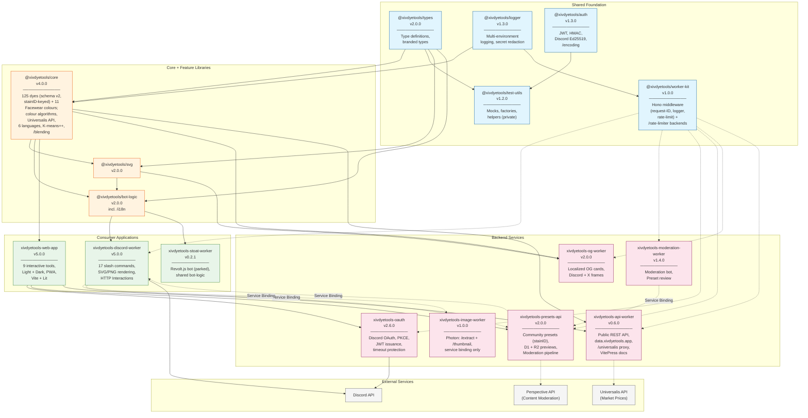

# Architecture Overview

**How the XIV Dye Tools ecosystem interconnects**

This document provides a high-level view of how all projects in the XIV Dye Tools ecosystem work together to deliver dye color tools across web and Discord platforms.

---

## Ecosystem Diagram


```mermaid
graph TB
    subgraph "Shared Foundation"
        TYPES["@xivdyetools/types<br/>v2.0.0<br/>─────────────<br/>Type definitions,<br/>branded types"]
        LOGGER["@xivdyetools/logger<br/>v1.3.0<br/>─────────────<br/>Multi-environment<br/>logging, secret redaction"]
        AUTH["@xivdyetools/auth<br/>v1.3.0<br/>─────────────<br/>JWT, HMAC,<br/>Discord Ed25519,<br/>/encoding"]
        WKIT["@xivdyetools/worker-kit<br/>v1.0.0<br/>─────────────<br/>Hono middleware<br/>(request-ID, logger,<br/>rate-limit) +<br/>/rate-limiter backends"]
        TEST["@xivdyetools/test-utils<br/>v1.2.0<br/>─────────────<br/>Mocks, factories,<br/>helpers (private)"]
    end

    subgraph "Core + Feature Libraries"
        CORE["@xivdyetools/core<br/>v4.0.0<br/>─────────────<br/>125 dyes (schema v2,<br/>stainID-keyed) + 11<br/>Facewear colours;<br/>colour algorithms,<br/>Universalis API,<br/>6 languages, K-means++,<br/>/blending"]
        SVG["@xivdyetools/svg<br/>v2.0.0"]
        BOTLOGIC["@xivdyetools/bot-logic<br/>v2.0.0<br/>incl. /i18n"]
    end

    subgraph "Consumer Applications"
        WEB["xivdyetools-web-app<br/>v5.0.0<br/>─────────────<br/>9 interactive tools,<br/>Light + Dark, PWA,<br/>Vite + Lit"]
        DISCORD["xivdyetools-discord-worker<br/>v5.0.0<br/>─────────────<br/>17 slash commands,<br/>SVG/PNG rendering,<br/>HTTP Interactions"]
        STOAT["xivdyetools-stoat-worker<br/>v0.2.1<br/>─────────────<br/>Revolt.js bot (parked),<br/>shared bot-logic"]
    end

    subgraph "Backend Services"
        OAUTH["xivdyetools-oauth<br/>v2.6.0<br/>─────────────<br/>Discord OAuth, PKCE,<br/>JWT issuance,<br/>timeout protection"]
        PRESETS["xivdyetools-presets-api<br/>v2.0.0<br/>─────────────<br/>Community presets (stainID),<br/>D1 + R2 previews,<br/>Moderation pipeline"]
        IMAGE["xivdyetools-image-worker<br/>v1.0.0<br/>─────────────<br/>Photon: /extract + /thumbnail,<br/>service binding only"]
        MODBOT["xivdyetools-moderation-worker<br/>v1.4.0<br/>─────────────<br/>Moderation bot,<br/>Preset review"]
        OG["xivdyetools-og-worker<br/>v2.0.0<br/>─────────────<br/>Localized OG cards,<br/>Discord + X frames"]
        APIWORKER["xivdyetools-api-worker<br/>v0.6.0<br/>─────────────<br/>Public REST API,<br/>data.xivdyetools.app,<br/>/universalis proxy,<br/>VitePress docs"]
    end

    subgraph "External Services"
        DISCORD_API["Discord API"]
        UNIVERSALIS["Universalis API<br/>(Market Prices)"]
        PERSPECTIVE["Perspective API<br/>(Content Moderation)"]
    end

    %% Foundation dependencies
    TYPES --> CORE
    LOGGER --> CORE
    LOGGER --> WKIT
    AUTH --> TEST
    TYPES --> TEST
    CORE --> SVG
    TYPES --> SVG
    CORE --> BOTLOGIC
    SVG --> BOTLOGIC
    TYPES --> BOTLOGIC

    %% Core/feature library consumers
    CORE --> WEB
    CORE --> OG
    CORE --> APIWORKER
    BOTLOGIC --> DISCORD
    BOTLOGIC --> STOAT
    SVG --> OG
    WKIT -.-> DISCORD
    WKIT -.-> MODBOT
    WKIT -.-> OAUTH
    WKIT -.-> PRESETS
    WKIT -.-> OG
    WKIT -.-> APIWORKER

    %% Application relationships
    WEB --> OAUTH
    WEB --> PRESETS
    WEB --> APIWORKER
    DISCORD -.->|"Service Binding"| PRESETS
    DISCORD -.->|"Service Binding"| IMAGE
    MODBOT -.->|"Service Binding"| PRESETS
    PRESETS -.->|"Service Binding"| DISCORD

    %% External API connections
    APIWORKER -.-> UNIVERSALIS
    DISCORD --> DISCORD_API
    OAUTH --> DISCORD_API
    PRESETS -.-> PERSPECTIVE

    classDef shared fill:#e1f5fe,stroke:#01579b
    classDef core fill:#fff3e0,stroke:#e65100
    classDef app fill:#e8f5e9,stroke:#2e7d32
    classDef backend fill:#fce4ec,stroke:#880e4f
    classDef external fill:#f5f5f5,stroke:#616161

    class TYPES,LOGGER,AUTH,WKIT,TEST shared
    class CORE,SVG,BOTLOGIC core
    class WEB,DISCORD,STOAT app
    class OAUTH,PRESETS,IMAGE,MODBOT,OG,APIWORKER backend
    class DISCORD_API,UNIVERSALIS,PERSPECTIVE external
```

---

## Project Relationships

### Dependency Layers

```
Layer 4: External Services
├── Discord API (authentication, interactions)
├── Universalis API (FFXIV market prices)
└── Perspective API (ML content moderation)

Layer 3: Backend Services (Cloudflare Workers)
├── xivdyetools-oauth → JWT issuance
├── xivdyetools-presets-api → Community presets
├── xivdyetools-moderation-worker → Preset moderation bot
├── xivdyetools-image-worker → Pixel extraction (service binding only)
├── xivdyetools-og-worker → Social media preview cards
└── xivdyetools-api-worker → Public REST API + Universalis proxy + developer docs

Layer 2: Consumer Applications
├── xivdyetools-web-app → Browser-based tools (9 tools)
├── xivdyetools-discord-worker → Discord bot (17 registered commands)
└── xivdyetools-stoat-worker → Revolt bot (parked; shared bot-logic)

Layer 1: Core + Feature Libraries
├── @xivdyetools/core → Colour algorithms, 125-dye database, blending (/blending)
├── @xivdyetools/svg → SVG card generation
└── @xivdyetools/bot-logic → Platform-agnostic bot commands + bot i18n (/i18n)

Layer 0: Shared Foundation
├── @xivdyetools/types → Type definitions, branded types
├── @xivdyetools/logger → Logging, secret redaction
├── @xivdyetools/auth → JWT, HMAC, Discord Ed25519, Base64URL/hex (/encoding)
├── @xivdyetools/worker-kit → Hono middleware + rate limiting (/rate-limiter)
└── @xivdyetools/test-utils → Testing utilities (workspace-private)
```

### Data Flow Summary

| Flow | Path | Purpose |
|------|------|---------|
| **Color Matching** | User → Web/Discord → Core → Response | Find closest dye to input color |
| **Market Prices** | Client → API Worker `/universalis` → Universalis API → Client | Real-time price data with caching |
| **Authentication** | User → OAuth → Discord API → JWT → Consumer | User identity |
| **Preset Submission** | User → Client → Presets API → Moderation → Storage | Community content |
| **Preset Voting** | User → Client → Presets API → Database | Community curation |
| **User Banning** | Moderator → Discord Bot → Presets API → Database | Content moderation |

---

## Project Summaries

### @xivdyetools/core (v4.0.0)

**Purpose**: Core TypeScript library providing colour algorithms and the FFXIV dye database — **125 standard dyes** in `dyes.json` (schema v2, stainID-keyed), plus the **11 Facewear colours** as a separate `facewearColors` collection.

**Key Capabilities**:
- Colour conversion (RGB, HSV, HSL, LAB, OKLAB, CMYK)
- Nearest-neighbour dye matching via k-d tree, with an exact linear scan for perceptual metrics
- Colour harmony generation (complementary, triadic, analogous, tetradic, inverted tetradic, …)
- Colourblindness simulation (Brettel algorithm)
- K-means++ palette extraction from images
- Universalis API integration with LRU cache and metrics
- 6-language localization (en, ja, de, fr, ko, zh)
- Colour blending — six algorithms incl. Kubelka-Munk spectral — via the `/blending` subpath
- Pre-computed lowercase names for fast search; LRU cache for `rgbToOklab()`

**v3.0.0 Breaking Change (schema v2)**: `colors_xiv.json` (136 entries × 16 fields) became `dyes.json` (125 entries × 7 fields, keyed by `stainID`). `rgb`/`hsv`/`lab`, `cost`/`currency`, and the five `is*` flags are derived at `DyeDatabase.initialize()`, so the runtime `Dye` object keeps its full 16-field shape and consumers of dye objects were unaffected. The 11 Facewear colours left the dye table for `facewearColors`; the synthetic negative-ID mechanism is retired, surviving only as the frozen `LEGACY_FACEWEAR_ITEM_IDS` map. `isMetallic` is now the Stain sheet's 16-dye gloss set (was a 14-dye name-prefix guess) and `isCosmic ≡ consolidationType === 'C'` (11 dyes, no longer polluted by the 9 Firmament dyes).

**v2.8.0**: absorbed `@xivdyetools/color-blending` as the `/blending` subpath export.

**v2.0.0 Breaking Change**: All type re-exports removed. Import `Dye`, `RGB`, `HexColor`, etc. from `@xivdyetools/types` directly.

**Patch 7.5 consolidation is active**: `CONSOLIDATED_IDS` holds real itemIDs (Type-A = 52254, Type-B = 52255, Type-C = 52256); `isConsolidationActive()` returns `true`; `ALLIED_SOCIETY_ACQUISITIONS` removed.

**Consumed By**: Web app, Discord worker, OG worker, API worker, SVG, bot-logic

---

### xivdyetools-web-app (v5.0.0)

**Purpose**: Browser-based interactive toolkit for exploring FFXIV dye colors.

**9 Tools**:
1. **Palette Extractor** - Extract colors from images and find matching dyes
2. **Gradient Builder** - Create color gradients between dyes
3. **Color Harmony Explorer** - Discover harmonious dye combinations
4. **Dye Mixer** - RGB color blending between dyes
5. **Swatch Matcher** - Match character colors to dyes
6. **Dye Comparison** - Side-by-side dye analysis
7. **Accessibility Checker** - Colorblindness simulation
8. **Community Presets** - Browse and share dye presets
9. **Budget Suggestions** - Find affordable dye alternatives

**Recent Highlights**:
- **v5.0.0**: Themes reduced to **Light + Dark** (`standard-light` / `standard-dark`), with legacy stored theme names migrated on load; mobile-friendly redesign
- **v4.11.0**: Consolidation Spectrum filter chips in the dye palette drawer; Budget matching-algorithm control
- **v4.10.0**: Result Card v4 "Spectrum" row (Standard / Wide #1 / Wide #2); SEC-001 `auth-button.ts` XSS hardening; "Exclude Allied Society Dyes" filter retired
- **v4.9.0**: Patch 7.5 dye consolidation active end-to-end — Market Board fans 3 consolidated prices to 105 dyes
- **v4.0.0**: Glassmorphism UI, tool renaming, Lit.js web components

**Technology**: Vite, Lit web components, Tailwind CSS 4, two themes

---

### xivdyetools-discord-worker (v5.0.0)

**Purpose**: Discord bot bringing dye tools to servers via slash commands.

The roster of record is `src/commands/registry.ts` — a single `COMMAND_REGISTRY` list that the
registration script checks schema parity against, `/about` builds its index from, and
`about.test.ts` asserts against. A command can no longer exist in the dispatch switch, the
registration schema, and `/about` in three different states.

**17 registered commands** by category:
- **Colour tools**: `/harmony`, `/mixer`, `/gradient`, `/extractor`, `/swatch`
- **Dye database**: `/dye`
- **Analysis**: `/comparison`, `/contrast`, `/accessibility`, `/a11y`, `/budget`
- **Community**: `/preset`
- **Utility**: `/preferences`, `/manual`, `/changelog`, `/about`, `/stats`

`/a11y` is a second registration sharing the `/accessibility` handler — Discord has no alias
mechanism — so the roster is 17 registrations covering 16 distinct commands.

**v5.0 Highlights**:
- `/contrast` split out of `/accessibility` for WCAG 1.4.11 pairs; `/changelog` added
- `/about` reworked to build its command index from the registry
- Photon image decoding moved out to `image-worker` behind the `IMAGE_WORKER` service binding, bringing the bundle back under Cloudflare's 3 MiB gzip limit

**v4.x Highlights**:
- v4.7.0: BUG-009 moderation buttons routable via `MODERATION_BOT_TOKEN`; throw-safe Discord API wrappers; world → DC → region price cascade in `/budget`
- v4.5.0: `/preferences set allied_society` option removed (post-Patch 7.5)
- Uses shared packages: `@xivdyetools/bot-logic` (incl. `/i18n`), `svg`, `core` (incl. `/blending`), `worker-kit`

**Technology**: Cloudflare Workers, HTTP Interactions, Hono, resvg-wasm

---

### xivdyetools-oauth (v2.5.0)

**Purpose**: OAuth2 authentication provider for the ecosystem.

**Features**:
- Discord OAuth2 with PKCE flow
- JWT issuance with HS256 signing
- 24-hour refresh token grace period
- Account merging support
- Timeout protection (10s token exchange, 5s user info fetch)
- XIVAuth integration

**Technology**: Cloudflare Workers, Hono, D1 database

**v2.4.0 Highlights**: SEC-003 `jsonDepthLimit` middleware (maxDepth 10, prototype pollution rejection); SEC-004 Hono `bodyLimit` (10 KB) on all `/auth/*`; CORS `maxAge` 24h → 1h; migrated middleware to `@xivdyetools/worker-middleware`.

---

### xivdyetools-presets-api (v2.0.0)

**Purpose**: REST API for community dye preset management.

**Features**:
- CRUD operations for presets — dyes are **stainIDs, 3–6 per preset** (2.0.0; legacy itemIDs rejected), one primary + up to two secondary categories (`community` retired; `appearance` / `zones` / `raids-trials` added), optional `example_link`, moderated preview images (R2 `THUMBNAILS` via image-worker `POST /thumbnail`, served from `shots.xivdyetools.app`)
- Voting system with per-user tracking
- Multi-layer moderation pipeline:
  - Local profanity filtering (6 languages)
  - Perspective API ML moderation (5s timeout protection)
  - Manual moderator review queue
- Rate limiting (10 submissions/user/day)
- Dual authentication (bot API key + JWT)
- Standardized API responses
- UTF-8 safe truncation for Discord embeds
- Race condition handling for duplicate detection
- Dynamic category validation (1-min cache)
- Discord notification retries with exponential backoff

**Technology**: Cloudflare Workers, Hono, D1 SQLite database, R2

**v2.0.0 Highlights**: stainID dyes + 3–6 rule, migrations 0007–0010 (community drop, `example_link`, preview image, secondary categories), beta CORS origin, `worker-kit`, dev/prod `wrangler.toml` split.

**v1.5.0 Highlights**: SEC-003 `jsonDepthLimit` middleware (100 KB body, prototype pollution rejection); SEC-004 Hono `bodyLimit` (100 KB) on `/api/*`; migrated to `rateLimitMiddleware()` from `@xivdyetools/worker-middleware` (standardized `X-RateLimit-*` + `Retry-After`); CORS `maxAge` 24h → 1h.

---

### xivdyetools-image-worker (v1.0.0)

**Purpose**: Host `@cf-wasm/photon` so `discord-worker` does not have to bundle it — decode an image URL into raw RGBA pixels (`POST /extract`) and crop/encode preset preview uploads into WebP thumbnails (`POST /thumbnail`).

Split out of `discord-worker` on 2026-08-09 ([IMAGE_WORKER_SPLIT](../operations/IMAGE_WORKER_SPLIT.md)) because the WASM payload pushed the bot past Cloudflare's 3 MiB gzip script limit (3,209.3 → 2,589.70 KiB after the split).

**Surface**: `POST /extract` (discord-worker) and `POST /thumbnail` (presets-api), reachable **only** via the callers' `IMAGE_WORKER` service bindings. No routes, no public hostname.

**Technology**: Cloudflare Workers, `@cf-wasm/photon`

---

### xivdyetools-moderation-worker (v1.4.0)

**Purpose**: Separate Discord bot for community preset moderation.

**Commands**:
- `/preset moderate [preset_id]` - Review pending presets
- `/preset ban_user <user>` - Ban user from preset system
- `/preset unban_user <user>` - Unban user

**Features**:
- Approve/reject presets with reasons (notifies author)
- Revert flagged edits to previous versions
- Multi-language support (6 languages)
- Full audit logging of moderation actions
- Startup environment validation (v1.1.5)

**Technology**: Cloudflare Workers, Hono

---

### xivdyetools-og-worker (v2.0.0)

**Purpose**: Dynamic OpenGraph cards for social media previews.

**Features**:
- Crawler detection (Discord, Twitter/X, Facebook, LinkedIn, Slack, Telegram, iMessage)
- **One 15E band frame for all nine tools**, on a 400-wide design grid rastered ×3 — Discord 1200×1050, X 1200×630 via `?frame=x` (carried by `twitter:image`). The two frames take separate cache keys
- **Default cards** at `/og/default.png` and `/og/:tool/default.png` — no fabricated dye names, deltas, or prices
- Localized via `?lang=` in all 6 languages, including the card artwork; SC, KR, and JP font subsets are bundled so JA no longer renders in Chinese letterforms
- Name wrapping with hyphenation rather than truncation (resvg has no `hyphens: auto`)
- SVG→PNG rendering via resvg-wasm

**v2.0.0 fixed the `/og/` prefix**, which was missing from every emitted `og:image` URL — the routes registered under `/og/` while the meta tags pointed one level up, so no generated card had ever actually been fetched.

**Routes**: `/og/:tool/*` for harmony, gradient, mixer, swatch, comparison, accessibility, extractor, presets, and budget.

**Technology**: Cloudflare Workers, Hono, resvg-wasm, `@xivdyetools/svg`

---

### xivdyetools-api-worker (v0.6.0)

**Purpose**: Public REST API for the XIV Dye Tools dye database and color matching, deployed to `data.xivdyetools.app`.

**Phase 1 — 9 Public Endpoints**:
- `GET /v1/dyes` — list with filtering (8 type/acquisition booleans), sorting, pagination
- `GET /v1/dyes/:id` — auto-detect ID type (stainID `1-254`, itemID `≥5729`; legacy negative Facewear IDs answer 404 carrying the new `facewearColors` slug)
- `GET /v1/dyes/stain/:stainId` — explicit stainID lookup
- `GET /v1/dyes/search?q=` — name search (localized via `?locale=`)
- `GET /v1/dyes/categories` — category list with counts
- `GET /v1/dyes/batch?ids=` — multi-ID lookup, max 50
- `GET /v1/dyes/consolidation-groups` — Patch 7.5 consolidation metadata
- `GET /v1/match/closest?hex=` — closest dye (`ciede2000` default / `oklab` / `cie76` / `redmean` / `rgb` / `distinguish`; legacy `hyab` / `oklch-weighted` accepted and normalised to `ciede2000`, `kL/kC/kH` ignored)
- `GET /v1/match/within-distance?hex=&maxDistance=` — dyes within ΔE threshold

**Features**:
- Anonymous (no auth, no API key) with permissive CORS
- KV-backed sliding-window rate limiting (60 req/min/IP, +5 burst)
- `localeMiddleware` resolves `?locale=` once per request (OPT-001)
- Structured logging via `@xivdyetools/worker-kit`

**Absorbed on 2026-07-31**: the standalone `universalis-proxy` (now the `/universalis` and `/api/v2` compatibility routes, keeping the dual-layer Cache API + KV caching, request coalescing, and stale-while-revalidate) and the `api-docs` VitePress site (now shipped as Workers Static Assets under `apps/api-worker/docs/`, serving `developers.xivdyetools.app`).

**Technology**: Cloudflare Workers, Hono, KV, VitePress

---

### xivdyetools-stoat-worker (v0.2.0)

**Purpose**: Revolt.js bot bringing dye tools to the Revolt platform. **Parked** — kept in the repo, no 5.0 investment, no current demand.

**Features**:
- Shared command logic and i18n via `@xivdyetools/bot-logic` (incl. its `/i18n` engine)
- Prefix-based commands (`!xivdye` / `!xd`)
- 4 commands: ping, help, about, info

**Technology**: Node.js 22+, revolt.js

---

### Shared Packages

| Package | Version | Purpose |
|---------|---------|---------|
| **@xivdyetools/core** | v4.0.0 | Colour algorithms, 125-dye database (schema v2), Universalis, blending (`/blending`) |
| **@xivdyetools/types** | v2.0.0 | Branded types (HexColor, DyeId, StainId) and shared interfaces |
| **@xivdyetools/logger** | v1.3.0 | Unified logging, secret redaction patterns |
| **@xivdyetools/auth** | v1.3.0 | JWT verification, HMAC signing, Discord Ed25519, Base64URL/hex (`/encoding`) |
| **@xivdyetools/worker-kit** | v1.0.0 | Hono middleware (request-ID, logger, rate-limit) + rate-limit backends (`/rate-limiter`) |
| **@xivdyetools/svg** | v2.0.0 | Platform-agnostic SVG card generators |
| **@xivdyetools/bot-logic** | v2.0.0 | Platform-agnostic bot command logic + bot UI translation engine (`/i18n`) |
| **@xivdyetools/test-utils** | v1.2.0 | Cloudflare bindings mocks, domain factories, test helpers (workspace-private) |

---

## Communication Patterns

### Service Bindings (Worker-to-Worker)

Cloudflare Service Bindings enable zero-latency communication between workers:

```typescript
// Discord Worker calling Presets API
if (env.PRESETS_API) {
  // Service Binding (no HTTP overhead)
  return env.PRESETS_API.fetch(request);
}
// Fallback to HTTP
return fetch(`${env.PRESETS_API_URL}/presets`, options);
```

**Binding Map**:
```
xivdyetools-discord-worker
├── PRESETS_API   → xivdyetools-presets-api (Service Binding)
├── IMAGE_WORKER  → xivdyetools-image-worker (Service Binding)
└── KV_STORAGE    → Rate limits, user preferences (KV Binding)

xivdyetools-moderation-worker
└── PRESETS_API   → xivdyetools-presets-api (Service Binding)

xivdyetools-presets-api
├── DB            → D1 Database (presets, votes, moderation)
├── DISCORD_WORKER→ xivdyetools-discord-worker (Service Binding, notifications)
└── KV_CACHE      → Response caching (KV Binding)

xivdyetools-api-worker
├── PRICE_CACHE   → Universalis price data, 5-min TTL (KV Binding)
└── STATIC_CACHE  → Item data, 24h TTL (KV Binding)
```

### REST API Communication

| Caller | Target | Authentication |
|--------|--------|----------------|
| Web App | OAuth Worker | N/A (initiates OAuth flow) |
| Web App | Presets API | JWT Bearer token |
| Discord Worker | Presets API | `BOT_API_SECRET` + user headers |
| Presets API | OAuth Worker | JWT verification (shared secret) |

---

## Deployment Architecture

```
                        ┌─────────────────────────────────────┐
                        │          Cloudflare Edge            │
                        │         (Global Distribution)       │
                        └─────────────────┬───────────────────┘
                                          │
        ┌─────────────────────────────────┼─────────────────────────────────┐
        │                                 │                                 │
        ▼                                 ▼                                 ▼
┌───────────────────┐         ┌───────────────────┐         ┌───────────────────┐
│  Cloudflare Pages │         │  Cloudflare       │         │  Cloudflare       │
│                   │         │  Workers          │         │  D1 Database      │
│  xivdyetools      │         │  • discord-worker │         │                   │
│  web-app          │         │  • image-worker   │         │  • presets        │
│  (Static assets)  │         │  • moderation-wkr │         │  • votes          │
│                   │         │  • oauth          │         │  • users          │
│                   │         │  • presets-api    │         │  • moderation     │
│                   │         │  • api-worker     │         │                   │
│                   │         │  • og-worker      │         │  (oauth keeps its │
│                   │         │                   │         │   own D1)         │
└───────────────────┘         └───────────────────┘         └───────────────────┘
                                          │
                                          │ KV Storage
                                          ▼
                              ┌───────────────────┐
                              │  Cloudflare KV    │
                              │                   │
                              │  • Rate limits    │
                              │  • User prefs     │
                              │  • Response cache │
                              │  • Price cache    │
                              │  • Static cache   │
                              └───────────────────┘
```

---

## Related Documentation

- [Dependency Graph](dependency-graph.md) - Detailed npm and service dependencies
- [Service Bindings](service-bindings.md) - Worker-to-worker communication
- [Data Flow](data-flow.md) - Sequence diagrams for key flows
- [API Contracts](api-contracts.md) - Inter-service API specifications
